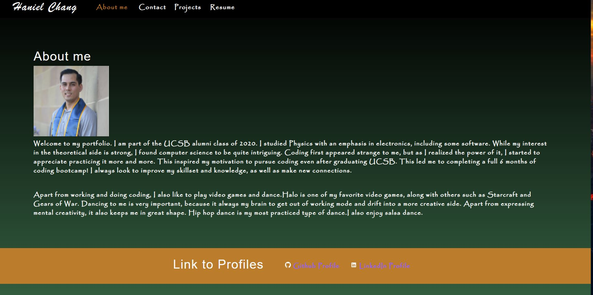

# React Portfolio
This is my 2nd personal portfolio. What makes it different compared to my first is that I am using react, which has
powerful features to allow for Single Page Applications. Rather than having my bio, projects, and contact information 
all on the same page, here we have different pages for each of these sections. When you click on the navigation buttons
in the header, the pages will now dynamically change, rather than jump to the corresponding section of the homepage.
I had much fun making this second profile, please enjoy!

## Application Link

Click this link to see: https://hanielchang.github.io/react-portfolio/

### Homepage

